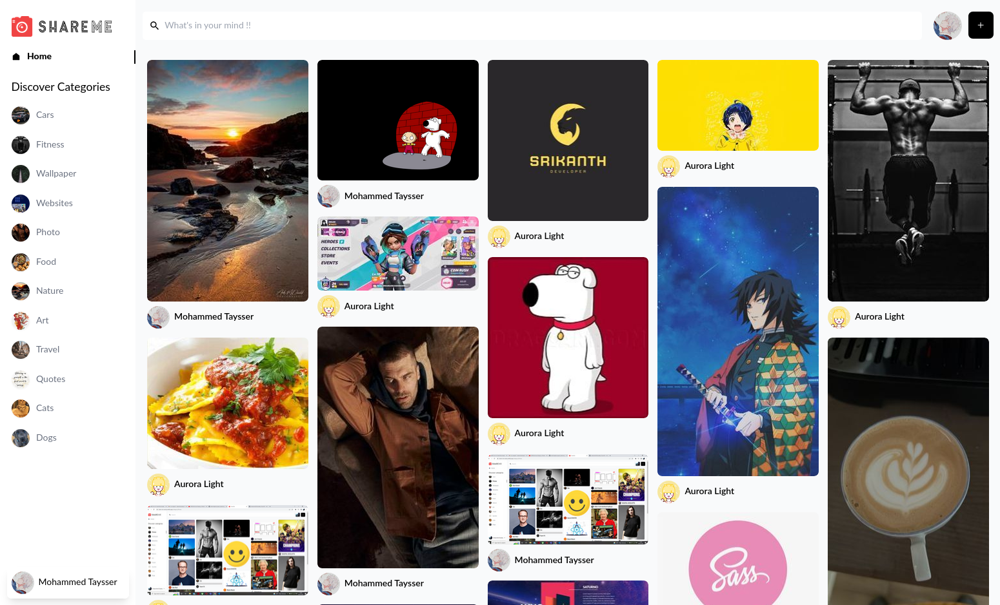

# ShareMe Social Media Application

Image Sharing Social Media App

[demo](https://shareme-psi.vercel.app/), [api](https://shareme-psi.sanity.studio/)



## Used tools

- [`tailwindcss`](https://tailwindcss.com/)
- [`uuid`](https://www.npmjs.com/package/uuid)
- [`react-masonry-css`](https://www.npmjs.com/package/react-masonry-css)
- [`react-loader-spinner`](https://www.npmjs.com/package/react-loader-spinner)
- [`jwt-decode`](https://www.npmjs.com/package/jwt-decode)
- [`typescript`](https://www.npmjs.com/package/typescript)
- [`React-Icons`](https://react-icons.github.io/react-icons)
- [`React-Router-Dom`](https://reactrouter.com/docs/en/v6/getting-started/tutorial)
- [`React.js`](https://reactjs.org/)

## Quick start 🚀

### First Step

```shell
git clone https://github.com/Mohammed-Taysser/shareme.git
```

### Second Step

Inside shareme Directory Install Dependencies By

```shell
npm install
```

### Last Step

Start The Development Server

```shell
npm start
```

## Features 💬

- Designed with progressive enhancement in mind.
- Standalone With Only React
- Build using typescript instead of javascript
- using laze loading to reduce page loading
- customize error boundary component
- fully responsive
- create api using sanity
- using types into single file [`react-app.env.d.ts`](src/apps/react-app-env.d.ts)

## Inspired

- [Build and Deploy a Modern Full Stack Social Media App FULL COURSE](https://www.youtube.com/watch?v=1RHDhtbqo94&t=7s)

## Contribution 🤝

1. Fork it!
2. Create your feature branch: `git checkout -b feature-name`
3. Commit your changes: `git commit -am 'Some commit message'`
4. Push to the branch: `git push origin feature-name`
5. Submit a pull request 😉😉

## License 📜

MIT © [`Mohammed Taysser`](https://github.com/mohammed-Taysser/)
